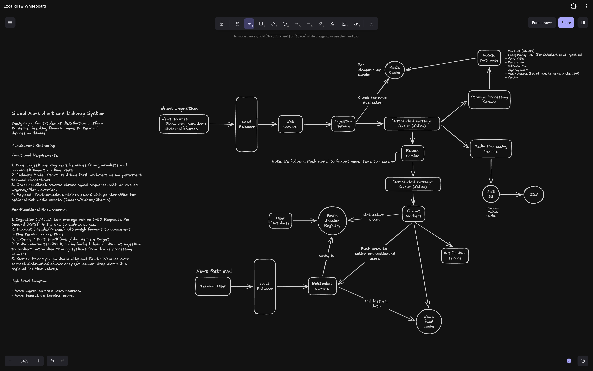

## Global News Alert And Delivery System

### Phase 1: Ingestion & Buffering

When content originates from Bloomberg journalists or external wire feeds, it hits our Ingestion tier via a Load Balancer and stateless Web Servers. The Ingestion Service instantly verifies news item uniqueness via a cryptographic token (Idempotency Hash) lookup against a Redis Cache to guarantee message deduplication at the gateway. If unique, it drops the raw payload into our first Distributed Message Queue (Kafka) and returns a 202 acknowledgment.

Asynchronously, dedicated consumer workers pull from this Kafka topic: the Storage Processing Service commits metadata to our NoSQL Database, and the Media Processing Service extracts binary assets to dump into AWS S3 where they are cached globally at edge locations by a CDN.

### Phase 2: Regional Isolation & Delivery

Simultaneously, the first-stage Fanout Service passes the alert down a second, regionalized Kafka cluster. This decouples downstream client delivery mechanics entirely from our ingestion ingestion tier.

Fanout Workers pick up the message from the queue and consult our Redis Session Registry to see which terminal users are online and exactly which machine they are connected to. The worker then routes the lightweight alert payload directly to those targeted WebSocket Servers.

Because our Terminal Users maintain long-lived, active connections with these stateful WebSocket nodes, the nodes instantly push the alert down the open socket in sub-100ms. If a user has just logged on or reconnected after being offline, the WebSocket server will proactively query our News Feed Cache (a Redis Sorted Set) to catch them up on historical headlines before merging them into the active live stream.

### Engineering Details

### Q1: "How do you handle failures in the asynchronous workers?"

If the `Storage Processing Service` crashes while trying to write a news story to the NoSQL database, how do you prevent that message from being lost forever?

**Answer:** Because we use Kafka, we don't lose data. We will utilize a Retry Topic and a Dead Letter Queue (DLQ) pattern. If a worker encounters a transient error, it will write the message to a retry topic to try again after a backoff period. If it repeatedly fails, the message moves to a DLQ for manual auditing, ensuring we maintain strict fault-tolerance without blocking the main Kafka partition.

### Q2: "How do you scale Kafka to match Bloomberg's global throughput?"

How do we ensure that messages don't pile up in Kafka during an intense market event?

**Answer:** We will partition our Kafka topics. For news alerts, we can partition by a combination of the `urgency_tier` and a hash of the `article_id`. This allows us to run multiple instances of our processing services concurrently in a Consumer Group, with each consumer handling a specific partition to process messages in parallel.

### Q3: "What happens if a specific WebSocket server node crashes with 50,000 active connections?"

**Answer:** The 50,000 terminals will detect the dropped socket connection and instantly attempt to reconnect. Our client-side load balancer will distribute those reconnection requests across our remaining active healthy WebSocket nodes. As users authenticate onto their new nodes, those nodes will update the Redis Session Registry, seamlessly shifting their routing paths for future alerts.

### Q4: "How do you handle a massive news flash that applies to millions of users at the exact same time without crashing the WebSocket servers (The Thundering Herd / Connection Fanout problem)?"

**Answer:** We keep our real-time payload incredibly lean—just the string text of the headline, unique identifier, and urgency score. We completely omit massive body paragraphs or media assets from the initial socket transmission. By keeping the packet sizes down to a few hundred bytes, our WebSocket servers can push out millions of concurrent messages across open TCP sockets without hitting internal network cards or memory buffering bounds.
