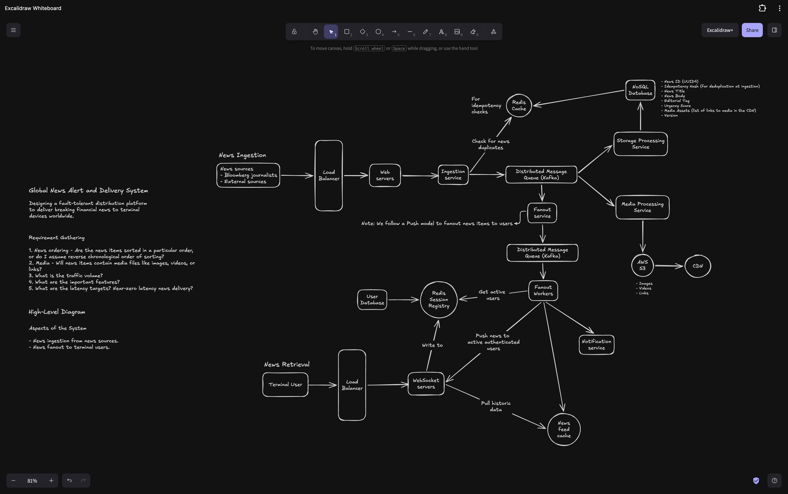

## Global News Alert And Delivery System

### Phase 1: Ingestion & Buffering

When content originates from Bloomberg journalists or external wire feeds, it hits our Ingestion tier via a Load Balancer and stateless Web Servers. The Ingestion Service instantly verifies news item uniqueness via a cryptographic token (Idempotency Hash) lookup against a Redis Cache to guarantee message deduplication at the gateway. If unique, it drops the raw payload into our first Distributed Message Queue (Kafka) and returns a 202 acknowledgment.

Asynchronously, dedicated consumer workers pull from this Kafka topic: the Storage Processing Service commits metadata to our NoSQL Database, and the Media Processing Service extracts binary assets to dump into AWS S3 where they are cached globally at edge locations by a CDN.

## Phase 2: Regional Isolation & Delivery

Simultaneously, the first-stage Fanout Service passes the alert down a second, regionalized Kafka cluster. This decouples downstream client delivery mechanics entirely from our ingestion ingestion tier.

Fanout Workers pick up the message from the queue and consult our Redis Session Registry to see which terminal users are online and exactly which machine they are connected to. The worker then routes the lightweight alert payload directly to those targeted WebSocket Servers.

Because our Terminal Users maintain long-lived, active connections with these stateful WebSocket nodes, the nodes instantly push the alert down the open socket in sub-100ms. If a user has just logged on or reconnected after being offline, the WebSocket server will proactively query our News Feed Cache (a Redis Sorted Set) to catch them up on historical headlines before merging them into the active live stream.

