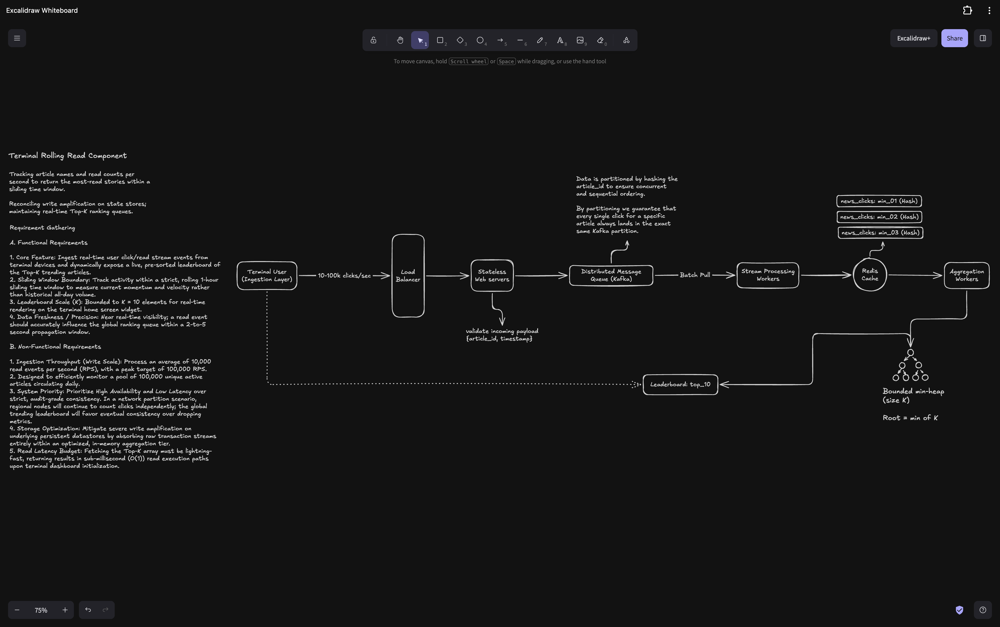

## Terminal Rolling Read Component

### Requirements Gathering

1. **Sliding Window Time:**

I assume this component tracks trending stories to capture immediate market momentum and velocity rather than stale all-day cumulative volume. What is the duration of the rolling sliding window for tracking these articles? Is it something like 15 minutes, or a full hour?

2. **Leaderboard Size (K):**

How many trending articles do we actually need to display on the terminal screen widget? Should we design the leaderboard to hold the Top 10 or Top 20 items?

3. **Traffic Volume:**

What kind of traffic scale are we expecting for this system? Roughly how many article clicks or read events are happening per second at peak times?

4. **Unique Articles:**

Approximately how many unique active news articles are circulating or being published on the platform each day?

5. **Accuracy vs. Speed:**

Does the leaderboard need to be perfectly accurate across every server down to the exact second, or is it okay if it takes a couple of seconds for a click to register on the board?

6. **System Priority:**

If there is a network partition or a regional server goes down, should the system prioritize Consistency (waiting to make sure every count is perfectly synchronized across the globe) or Availability (keeping the system online and counting clicks, even if the leaderboard is temporarily a few seconds out of sync)?

